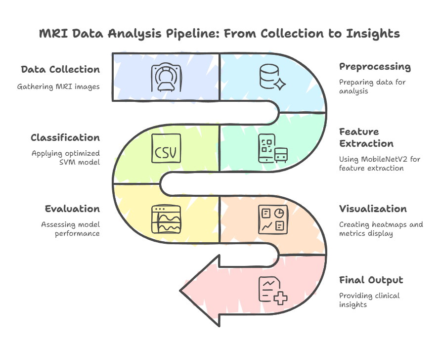
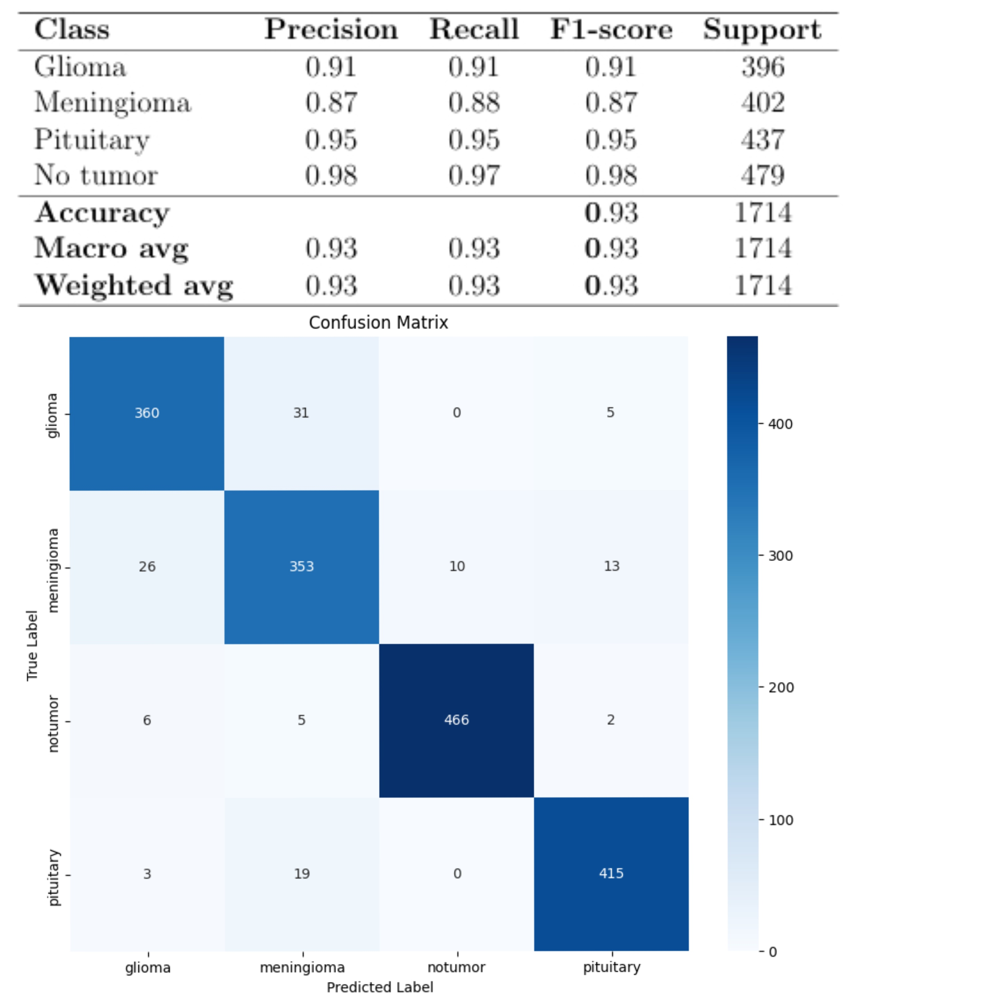
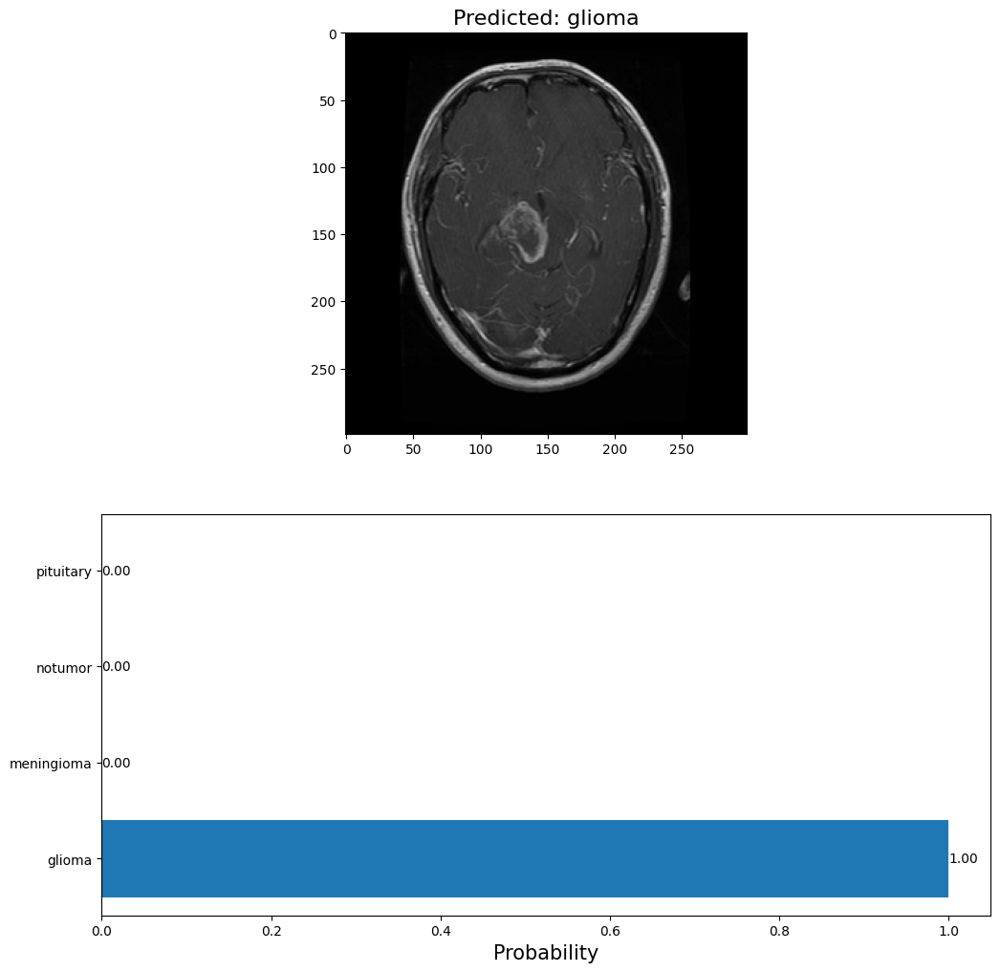
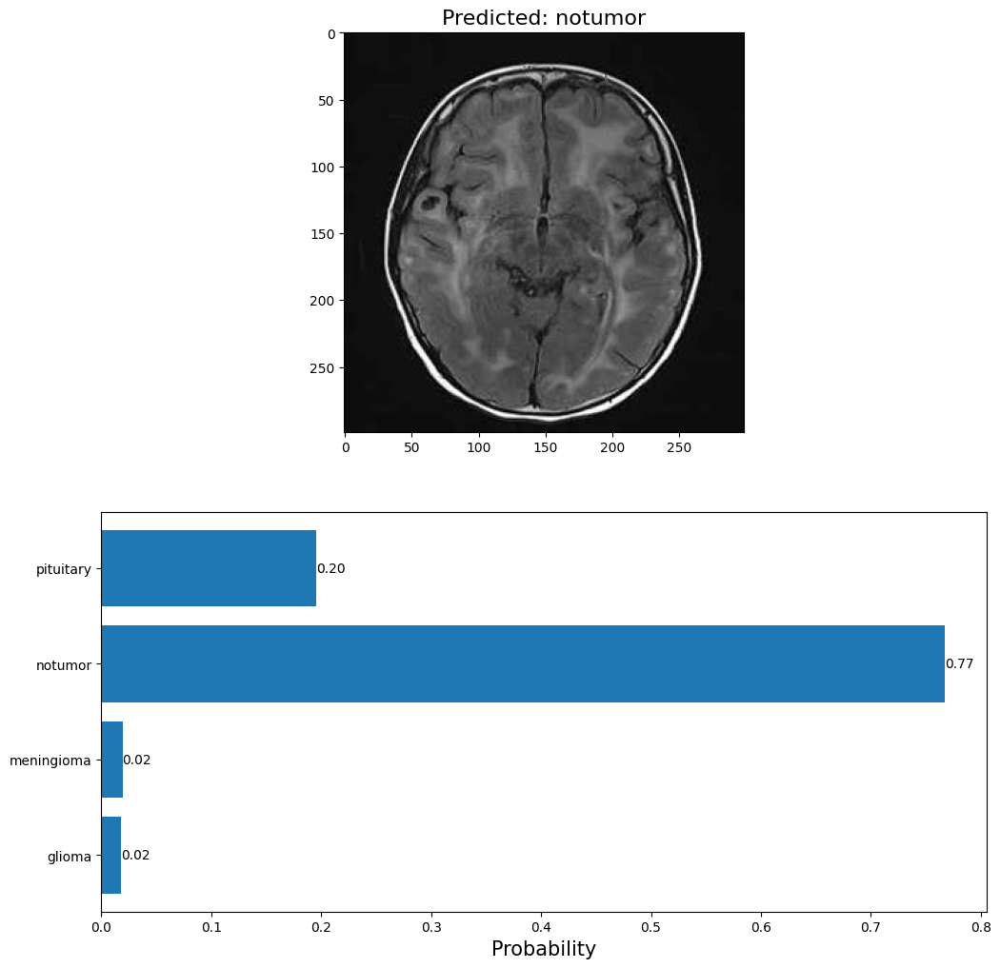
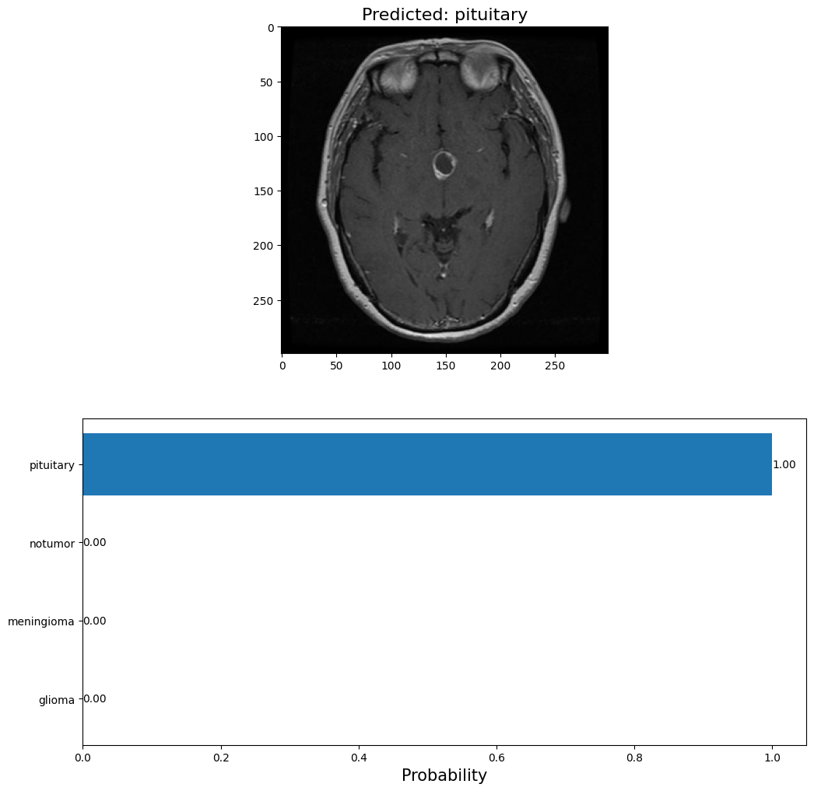
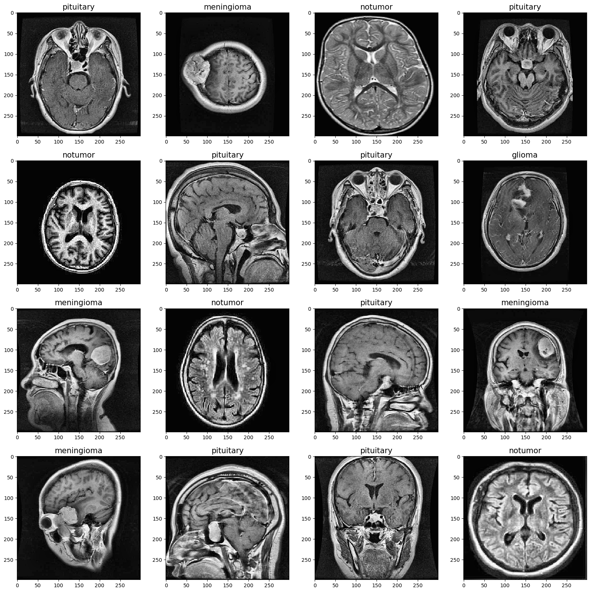

# 🧠 ENHANCED MRI BRAIN TUMOR DETECTION AND CLASSIFICATION USING HYBRID APPROACH

This project presents a deep learning-based hybrid approach for the **automatic detection and classification of brain tumors** using **contrast-enhanced MRI scans**. The system classifies MRI images into four categories: **Glioma**, **Meningioma**, **Pituitary**, and **No Tumor**. The model achieves outstanding performance with a classification accuracy of **~99%**, validated through **cross-validation** and **AUC-ROC** metrics.

📩 **Want the research paper?**  
Feel free to reach out at: **2208390100017@reck.ac.in**

---

## 📂 Dataset Information

The MRI dataset used in this project was sourced from **Kaggle**:

🔗 [Brain Tumor MRI Dataset (Kaggle)](https://www.kaggle.com/datasets/navoneel/brain-mri-images-for-brain-tumor-detection)

### 📊 Dataset Summary

| Class      | Number of Images | Training Set | Testing Set |
| ---------- | ---------------- | ------------ | ----------- |
| Glioma     | 1621             | 1321         | 300         |
| Meningioma | 1656             | 1339         | 306         |
| Pituitary  | 1757             | 1457         | 300         |
| No Tumor   | 2000             | 1595         | 405         |
| **Total**  | **7023**         | **5712**     | **1311**    |

---

## 🧠 How It Works

This project implements an automated brain tumor detection and classification system using a **hybrid deep learning–machine learning** approach. The key stages are:

### 🔄 Preprocessing
- **Noise Reduction:** Gaussian filtering  
- **Normalization:** Intensity scaling  
- **Enhancement:** Contrast, brightness  
- **Inversion & Resizing:** To 299×299  
- **Augmentation:** Rotation, shear, zoom

### 📥 Feature Extraction
- **Model:** MobileNetV2 (pre-trained on ImageNet)  
- **Purpose:** Extract high-level visual features via transfer learning

### 🧮 Classification
- **Classifier:** SVM with linear kernel  
- **Classes:** Glioma, Meningioma, Pituitary, No Tumor

### 🔍 Interpretability
- **Grad-CAM:** Heatmaps for tumor region localization

### 📈 Evaluation
- **Metrics:** Accuracy, Precision, Recall, F1-score, Confusion Matrix  
- **Results:** ~93%  accuracy

---

### 🧩 Model Visualization

A visual summary of the pipeline and model flow:



---

## 📈 Performance Metrics

* ✅ **Accuracy**: ~93%  
* 🧮 **Loss**: Converges quickly, minimal overfitting  
* 📌 **AUC-ROC**: High discriminatory power across all tumor types

### 📊 Classification Results:



---

## 🧪 Cross-Validation

The model was evaluated using **5-fold cross-validation** to ensure its stability and reliability across different data splits. Results showed consistent performance with minimal deviation across folds.

---

## 🔍 Example Predictions

| MRI Sample                         | Prediction      |
| ---------------------------------- | --------------- |
|        | Glioma Tumor    |
|     | No Tumor        |
|  | Pituitary Tumor |

Additional samples with enhanced features:


---

## 🧠 Dependencies

To run this project, install the following Python libraries:

```bash
pip install tensorflow keras matplotlib scikit-learn numpy opencv-python
````
```bash
pip install -r requirements.txt
````

---

## 🚀 Getting Started

To reproduce the results:

1. Clone this repository:

```bash
git clone https://github.com/arshdeep-yadav/Brain-Tumor-Detection-Hybrid-Approach.git
cd Brain-Tumor-Detection-Hybrid-Approach
```

2. Download the dataset from Kaggle:
   👉 [Download MRI Dataset](https://www.kaggle.com/datasets/navoneel/brain-mri-images-for-brain-tumor-detection)

3. Activate your environment and run the notebook:

```bash
jupyter notebook brain-tumor-mri-accuracy-99-auc-roc-cv.ipynb
```

---

## 📜 Citations

Please consider citing the following sources if you use this work in your research:

> **[Arshdeep Yadav](https://github.com/arshdeepyadavofficial)**, <br>
>  C.S.E; B.Tech 3rd Year, <br>
>  REC Kannauj

> Navoneel Chakrabarty. *Brain MRI Dataset*, [Kaggle](https://www.kaggle.com/datasets/navoneel/brain-mri-images-for-brain-tumor-detection)

> Chollet, François. *Deep Learning with Python*. Manning Publications, 2018.

---

## 📌 Future Work

* [ ] Deploy the model via Streamlit or Flask
* [ ] Integrate Grad-CAM for visual explanations
* [ ] Real-time MRI scan classification interface

---

## 👨‍💻 Author

Developed with 🖤 by **Arshdeep Yadav** <br>
🎓 CSE B.Tech 3rd Year <br>
🏫 Rajkiya Engineering College, Kannauj

🌐 Connect with me:

* [GitHub](https://github.com/arshdeepyadavofficial)
* [LinkedIn](https://www.linkedin.com/in/arshdeep-yadav-827aa1257?utm_source=share&utm_campaign=share_via&utm_content=profile&utm_medium=android_app)

---

## 📄 License

This project is licensed under the [MIT License](LICENSE).  
Feel free to use, modify, and share it with proper attribution.

```
